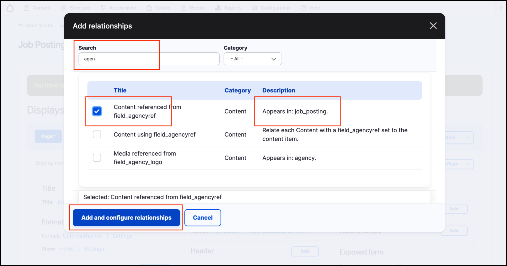

# Exercise 8.4: Agency logo in Job Posting view

In this exercise, we’ll add in the logo of the agency offering the job, by setting up a **View relationship**. In the current setup, the agency’s logo is part of the **Agency content type**, and the view of _Job Posting_ doesn’t allow us to show it. If we link the two content types together, we can display the agency logo in the job posting (like the screenshot below).

<figure><figcaption>
Job listing page showing Agency logos
</figcaption></figure>

## Preparation - create Agencies, update Job Postings

1.  Add some new Agency content and upload a logo for each. See the screenshot below for an example.\

    <figure><figcaption>
Adding an agency
</figcaption></figure>
2.  Update some existing **Job postings** to link to the agencies setup in step 1. See the screenshot below for an example.\

    <figure><figcaption>
Adding an agency reference to a job
</figcaption></figure>

## Add a relationship

Next, we need to add a relationship to the main Job Listing View so that we can join the data from the Agency content type (specifically the logo) into the Job posting content type.&#x20;

Without the relationship set up, if you tried to add a new field of “agency logo” to the **Job posting** _content type_ the results would be blank.

1. Go to the edit screen of your Job Listing view Click on **Advanced** in the right column. Under "Relationships" click **Add**.
2.  Next, search for "agency".

    <figure><figcaption>
Adding a relationship reference for Agency
</figcaption></figure>
3. Select **Content referenced from field\_agency**
4. Click **Add and configure relationships**. This will take you to the next configuration screen. Do NOT check the box "Require this relationship".
5. &#x20;Click the **Apply** button.&#x20;

## Add fields

1.  In the Fields section of your Job Listing view, click on Add field. Then search for logo (this is the logo field in your Agency content type).\

    <figure><figcaption>
Adding Logo field of agency
</figcaption></figure>

2.  In the fields setting, apply the following settings as show in the screenshot. \
    \- Set the relationship to the one you created in previously. \
    \- Give it a Label\
    \- Set an appropriate Image style\
    \- Optionally set "Link image to" content.\

    <figure><figcaption>
Field settings for logo field
</figcaption></figure>


**Important!** Remember to set the **Relationship** to reference the relationship created in the preceding steps.


3.  Change the Format to "Table" so the final output will look similar to the screenshot at the top of this page.\

    <figure><figcaption>
Changing format to Table
</figcaption></figure>

4. Save your View and visit your job listings page to view the results.
