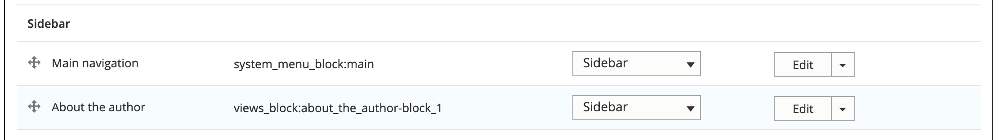
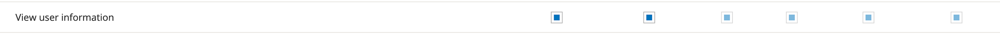

# Add About author block to News article

In this exercise we’ll create an author block.

## Prepare the site

To maximise this exercise, make sure user accounts have profile images. Out-of-the-box, GovCMS does not have a profile image available. Let’s add it.

1. Navigate to _Configuration_ → _People_ → _Account settings_ → **Manage fields**. You’ll notice that this interface is exactly the same as for _content types_.
2. Add an Image field, using your previous experience adding fields. Make the Image field match the following criteria:
 - **Field type**: Reference &gt; Image
 - **Label**: Profile Image
 - **Machine name**: field\_profile\_image

   
 
 - **Upload destination:** Public files
 - **Default image:** Upload a default generic profile image \(you may Google for “user profile placeholder”\)
 - **Allowed number of values:** 1

    
    
 - **Required field:** yes
 - **File directory:** profile_photos
 - **Minimum image resolution:** 150x150px
 - **Maximum upload size:** 1MB

    

3. Configure **Manage Display**:
   1. Place the **Profile Image** above all fields
   2. Hide the field label - **Visially Hidden**
   3. Apply _Image style_: Medium \(220 x 220\)

    
    
4. **Save** your changes.
5.. Add images to the profile of some website users. Alternatively use the _Generate users_ function \(**Configuration** → **Development** → **Generate users**\).
6. Change the authors of existing content so we have a variety of authors. Edit the “Authoring information” tab in the existing _News and Media_ and _Job postings_.

Alternatively use the _Generate content_ function \(**Configuration** → **Development** → **Generate content**\). Select News and Media, Job posting content types.

**Note:** If the _Generate content function_ was used, make sure you publish your _News_ and _media_ posts. Remember, they’re not published by default due to the _Moderation workflow_ in place.

## Add a new View

1. Go to _Structure_ → _Views_ → **Add View**.
2. Use the following information to fill out the form:
 - **View name:** About the author
 - **Show** “Users” **sorted by** “Unsorted”
 - Select **“Create a block”**
 - **Display format** - _Unformatted list_ of _Fields_.
 - Change **Items per block** to 1. Use the defaults for everything else \(ensure the settings are as shown in the image below\)

    

3. **Click Save and edit**

This loads the full **Views editing** screen. The screenshot below correlates to the steps outlined in the next sections.

## Add fields to the View

Notice the “Advanced” options available in Views.

1. In the left column, find and edit fields by clicking **Add**.
2. Select **Profile image** \(User\).
3. Click **Add and configure fields**.
4. On the next configuration popup screen, apply the _Image style_ **Medium \(220x220\)**.
5. Make the image linking to **Content**.
6. **Apply** your changes.
7. Rearrange the **User: Profile Image** field to stay above the **User: Name** field

## Make display dependent on author of content \(contextual filter\)

1. On the right-hand side, click **Advanced** to expand the settings.
   - Next to **Contextual filters** click **Add**.

2. In the next screen, type “**ID**” into the search field.
   - Select **“User ID”**.
   - Click **Add and configure contextual filters**.

3. In the next screen, select “Provide default value”. This opens extra options.
   - **Type:** “User ID from route context”
   - Toggle **“Also look for a node and use the node author”** to on.

4. Select _Specify validation criteria_ under **“When the filter value IS available or a default is provided”** and select **User ID** as **Validator**.
   
   

5. Click **Apply**.
6. Click **Save** to save the view.

## Check the preview

When you check the preview you’ll notice nothing is displaying. To fix this:

1. Type 1 and click **Update preview**. This pulls in the profile of user/1.
2. Click **Save** at the top of the Views editing screen.

## Place the block and test

Now we can configure the block to display on News and Media articles. The News and Media content type is set up by default to use Panelizer view. The Panelizer view replaces the default GovCMS page layout and provides a way to build a “layout within layout”.

Check the _Manage Display_ page of the _News and media_ content type:

You’ll see that the page has multiple View modes activated. The Full content view mode overrides the page display for our content type. Let’s explore it.

Notice that this display configuration page looks completely different to our Job posting content type. Instead of fields and display modes we see Displays here. By default, the Sidebar right display is used to render our News and Media content.

You may also notice that the Content Editors are allowed to select which display to use. This flexibility provides alternative display options for showing our News and Media articles, but introduces some extra complexity in configuring it.

## Review Panelizer content configuration

Let’s review how the Panelizer content is configured. We’ll practice placing the Content Author block in our News and Media articles.

1. Click the **Edit** button in the Sidebar Right \(2:1\) row 

    

2. Click the **Content** vertical tab on the left:  

    

3. Explore the Content page. See how it has their own regions defined  

    

4. Click the **Add new block** button at the top of the page
5. Under the Lists \(Views\), locate the block we prepared earlier:  
    
    

6. Select **Sidebar** region and **Add block**  
    
    

7. Position the About the author block below other blocks within the Sidebar region  

    

8. Click Update and Save

Test it by navigating to a published News and Media article. You may update the content of the page and the Authoring information, to check how the display changes.

Logout and test: Can anonymous users see the block?

At the moment, anonymous users can’t see the block. The final step is to set up permissions so anonymous users can see user profiles.

1. Go to People → Permissions
2. Scroll down to “View user information”
3. Select to allow _Anonymous_ and _Authenticated users_ to View user information 

    
    
4. Scroll down and click **Save permissions**

Now when you go back and check the site as an anonymous user you’ll see the author information.

