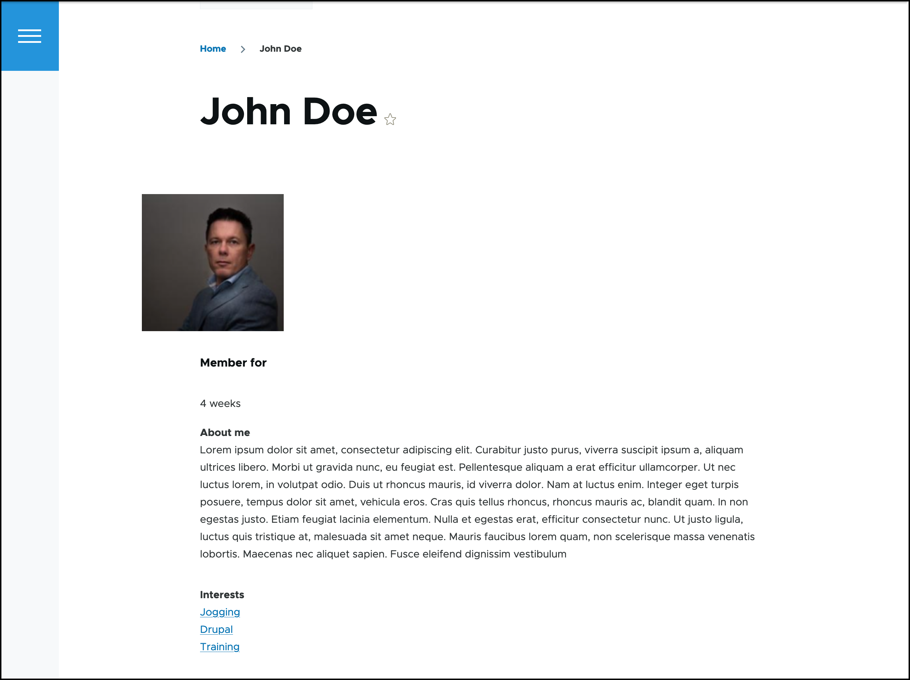
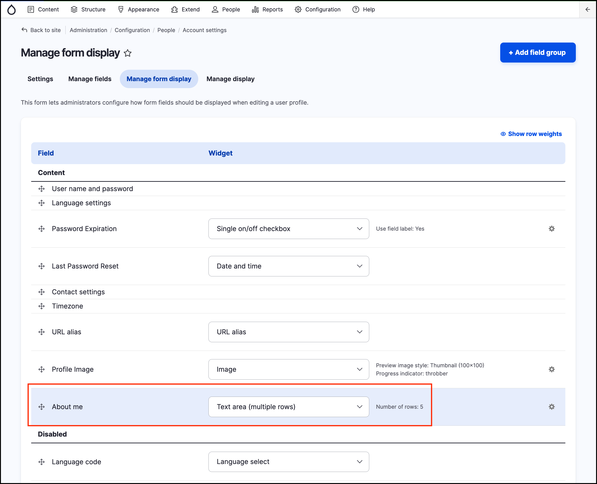
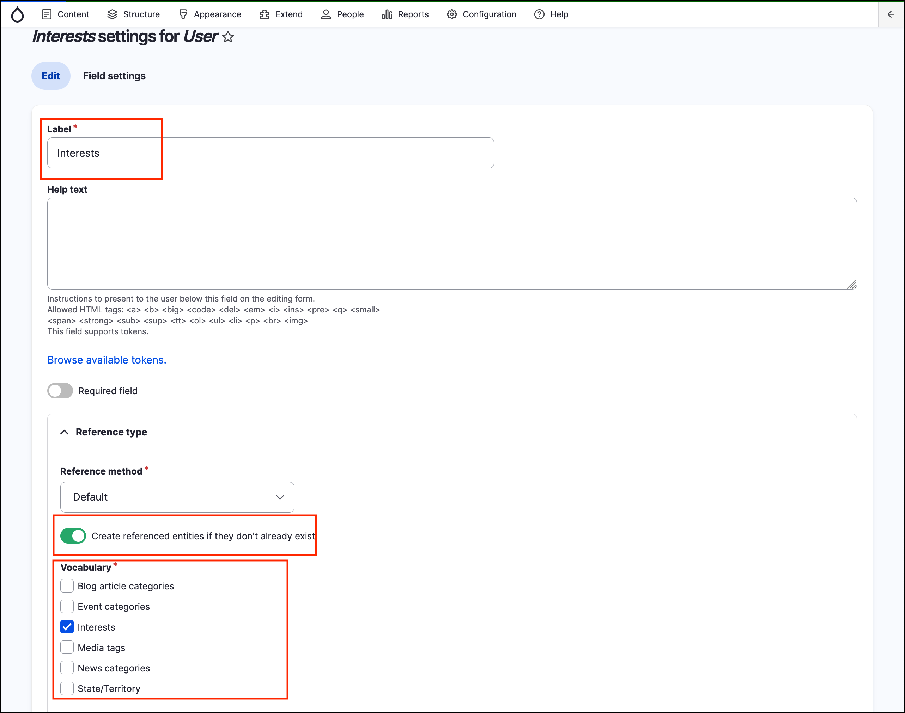
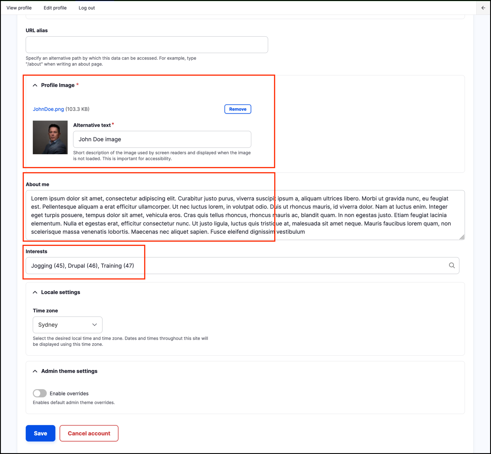

# Exercise 8.7: Set up profile fields

Previously, you added fields to content types. You can also add fields to user profiles. This means you can let users share information about themselves and then you can display it. You can also control permissions so only trusted users can see profiles. Below you can see the profiles will have a text field for description and also a list of interests and a profile picture.

## Add a text field for a biography

1. Go to _Configuration_ → _People_ → _Account settings_ → **Manage fields**.
2. This interface is similar to the one for adding fields to content, now you can Add a new field with the following settings:
  1. **Type:** Text → Text \(plain, long\)
  2. **Label:** About me
  3. **Machine Name:** field\_about\_me
     
3. Go to the **Manage form display** tab and set the **Widget** for About me to: _Text area \(multiple rows\)_.

    
    
4. Review the User settings. We will keep all the default settings, however, review the options before you save.
5. Click Save settings.

## Add a taxonomy field for interests

We need to create a new “Interests” vocabulary we can use in this case.

1. Go to _Structure_ → _Taxonomy_ → **Add vocabulary**.
  1. **Name:** Interests
  2. **Save** the vocabulary
  3. At this stage we can decide not to add any terms to the vocabulary, rather rely on users to add them when they create or update their profile.
2. Go back to _Configuration_ → _People_ → _Account settings_ → **Manage fields**.
3. **Add** a new field:
   - **Type:** Reference → Taxonomy term
   - **Label**: Interests
   - **Allowed number of values:** Unlimited
   - **Create referenced entities if they don't already exist:** Yes
   - **Vocabulary**: Interests

    
   
   - **Widget:** Select _Autocomplete \(Tags style\)._ This can be configured after you add the field, from the _Manage form display_ tab.
   - **Save** settings.

## Test by editing your account
  
Return to the front page.

1. Click **Your username** in the top administration menu, then _View profile_, then the **Edit profile** tab. 

    
    
2. At the bottom of the form you can see the options available.
3. Fill in some text for **About me** and type in tags \(comma-separated for multiple tags\) for **Interests**, such as _Jogging, Sailing, Drupal._
4. Under **Picture**, upload an image if you haven't already.
5. Save.

Click the **View** tab and now you can view the admin profile.

You can also manage the display of the fields, for example hiding the label. As your Drupal skills improve, you can make changes to the site design through _Theming_ to alter the way this information looks; or change what displays through _Manage display_ configuration pages.

