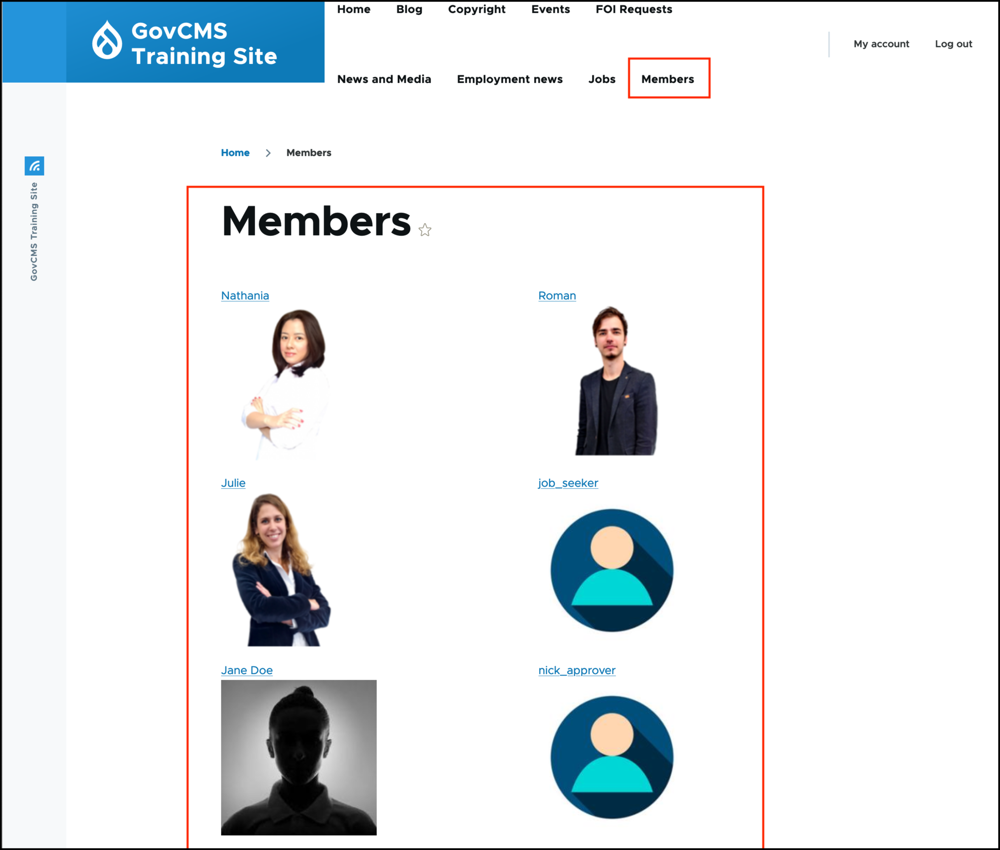
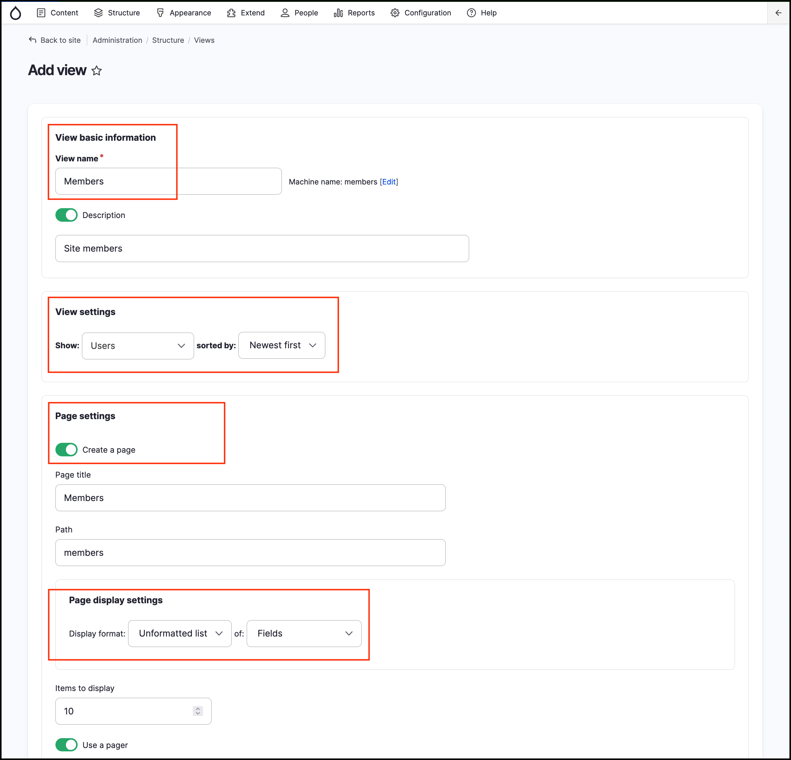
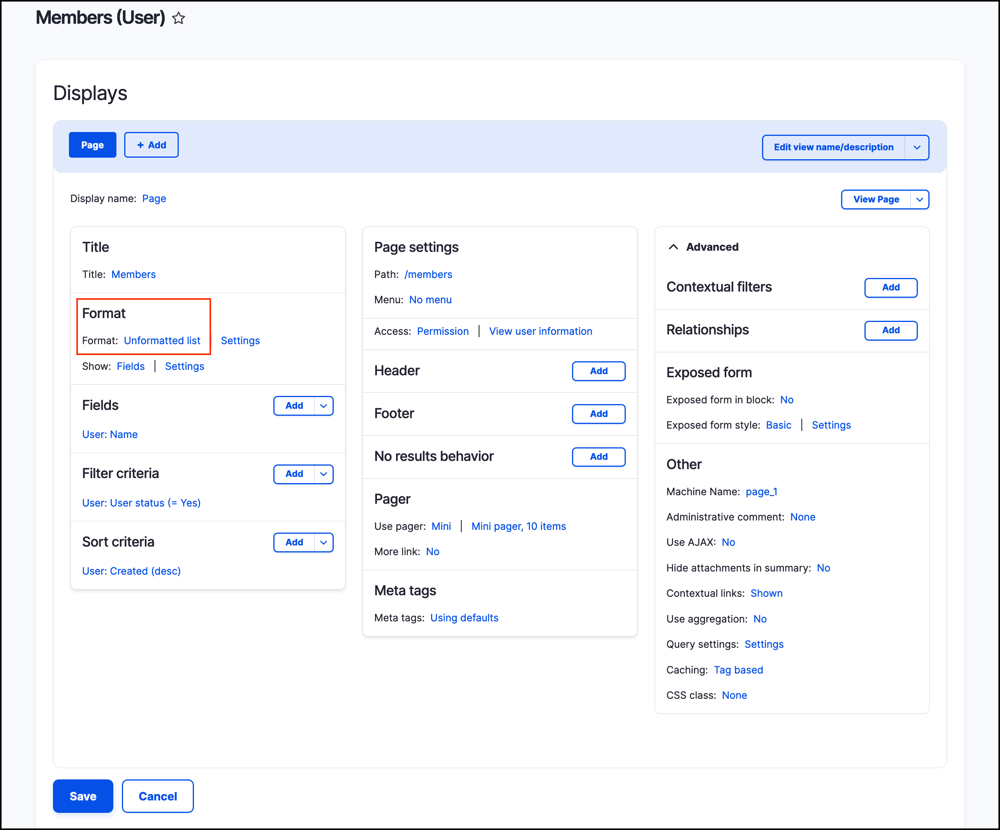
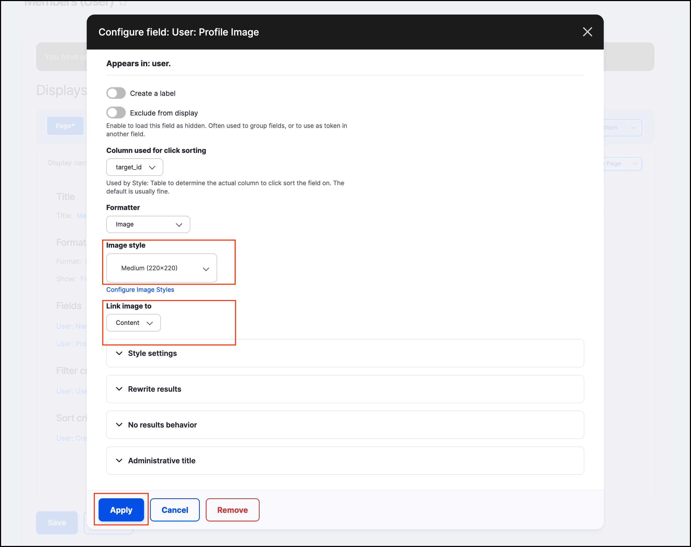
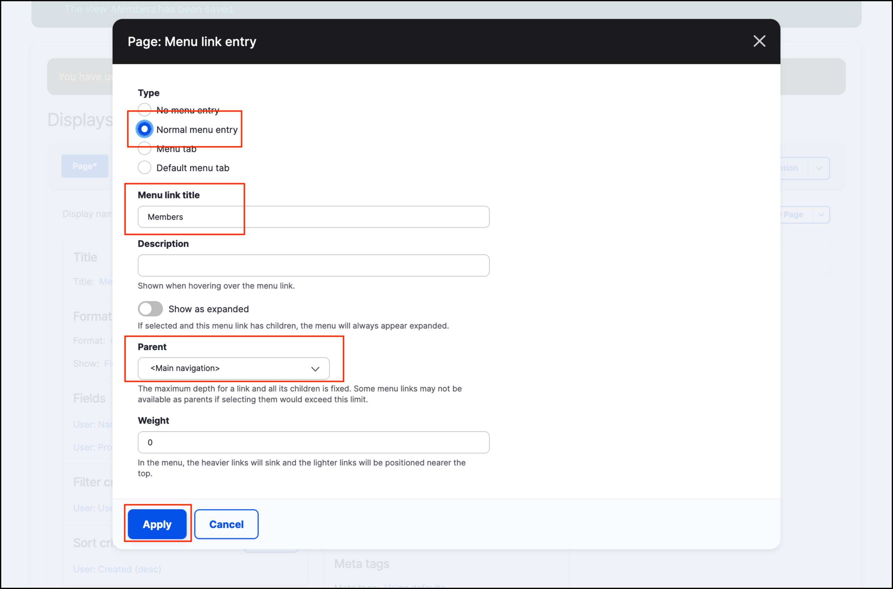

# Exercise 8.8: Create a list of users

In this exercise, you’ll make a grid display of user profile pictures like this:

1. Go to _Structure_ → _Views_ → **Add view**.
2. Configure your view with the following settings:
   - **View name:** Members
   - **Show** Users **sorted by** Newest first.
   - Under _Create a page_, ensure the _Display format_ is Unformatted list of _Fields_.
    
    

3. Keep the remaining defaults and click **Save and edit**.
    You are now in the **Advanced settings**. At the bottom, you can see a **Preview** of your new view. What do you see? We will change to show usernames and user pictures.
    
    
    
4. Under **Format** - Click to “Unformatted list”. This opens a dialog window. **Format** to _Grid._
5. Select _Grid_. 
6. Set **Number of columns** to 2. 
7. Leave the other settings as their defaults.
8. Click **Apply**.

## Add user picture

Next, we’ll add the user picture.

1. Under the **Fields** settings, click **Add.**.
2. Search for “profile” and select _Profile Image_. 
3. Click **Add and configure fields.**.
3. Select **Medium \(220 x 220\)** _Image style_.
4. Set the image to **Link to** _Content_.
5. Click **Apply**.

## Add link to Main navigation

Finally, we’ll add a link to the main navigation. 

1. Under _Page settings_ → _Menu_ click the **“No menu”** link.
2. **Type:** Normal menu entry.
3. Add a _menu link title_ **Members**.
4. Scroll down to **Menu** to select _&lt;Main navigation&gt;._
6. Click **Apply.**

    
    
7. Scroll down to the Views **Preview** and review if the results are as expected. Click **Save**.
8. Test your new view. In the main navigation, you should have a menu link to “Members”, and a page available at [http://example.com/members](http://example.com/members)

