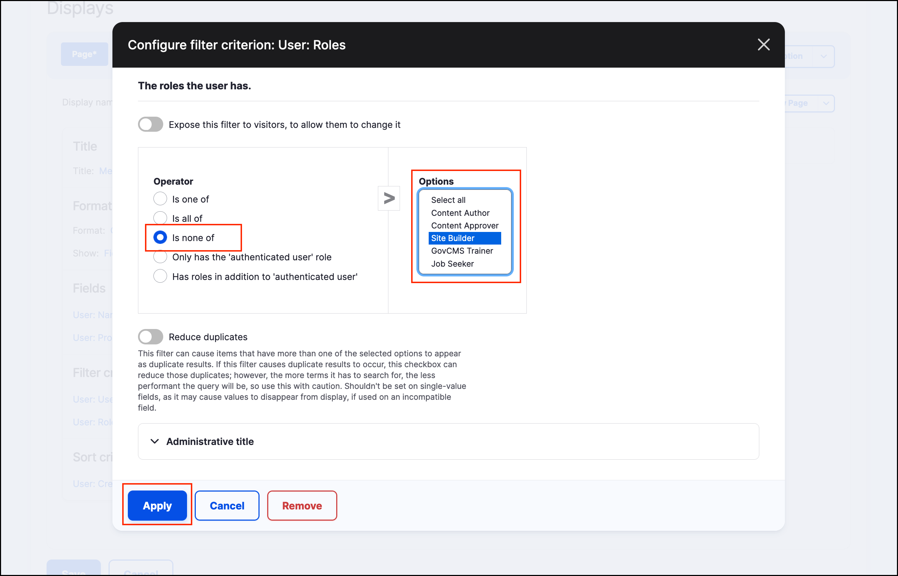

# Exercise 8.9: Edit the existing view to filter out roles

As seen in the screenshot from the previous exercise, the view we built shows the site administrator user. If we had multiple users in the Site Administrator role, all administrators would be listed here, in our view. In this exercise we hide those administrator users, by adding a role filter to our view.

1. Go to _Structure_ → _Views_ and locate our _Members_ view. Click the **Edit** button.
2. Click the **Add** button next to the _Filter Criteria_ section.
3. Search for “roles” and select **Roles** filter. Apply the changes.
4. In the next screen, select **Is none of** _operator_ and select the **Site Builder** in the **Options** list.

    
    
5. Apply your changes and preview the result below.
6. Save the view and review the Members page. You shouldn’t see any users who have the **Site Builder** role.
