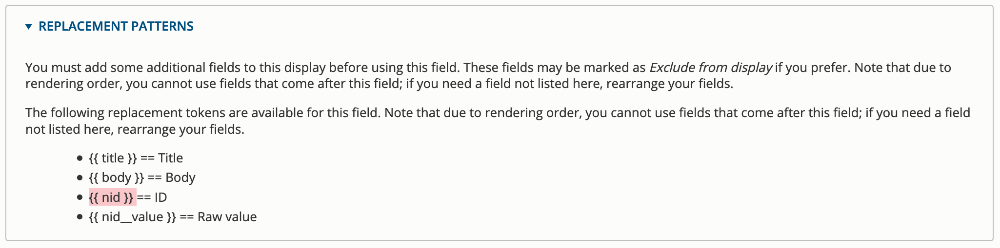
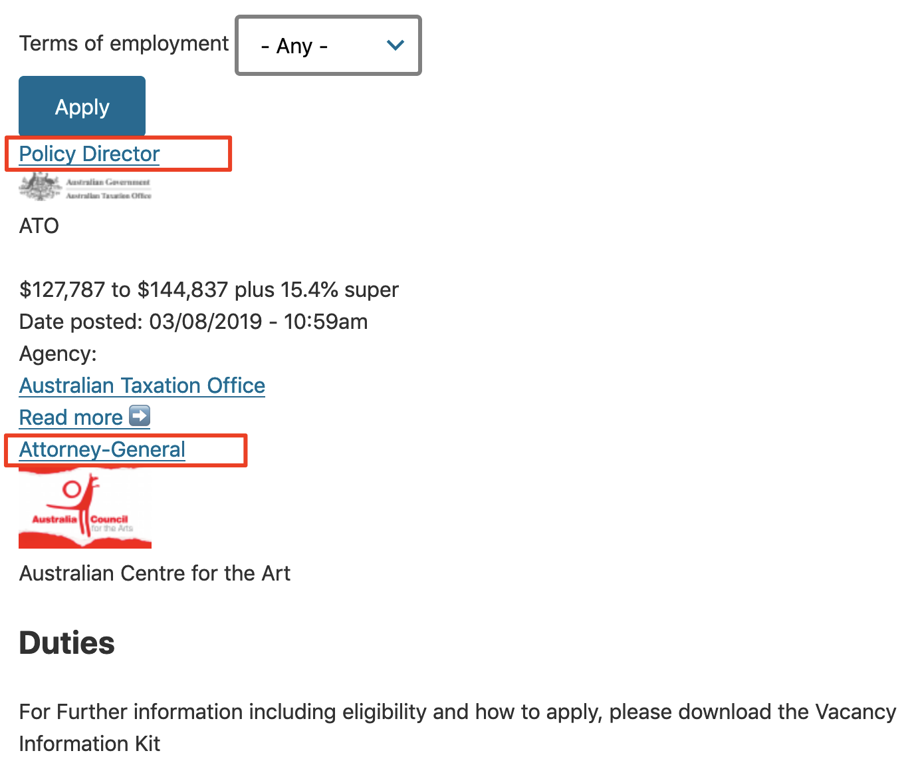
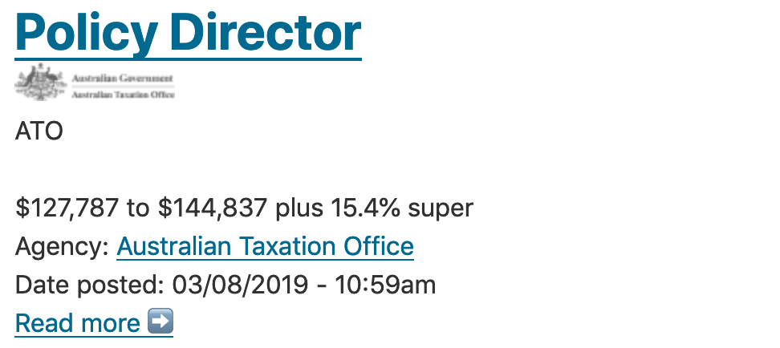

# Job list dropdown filter

Most people looking at jobs websites like a quick way to sort the job postings. For example, jobs could be sorted by the type of employment - full-time, part-time, etc.

#### **Exercise 8.3:** Configure the job listing

In this exercise we’ll configure the job listing so it filters by terms of employment.

1. **Edit the job listing** \(or create it if you haven’t already\)
   1. If you’ve already created the Job list view, skip to the step

**Configure the view**  

* 1. If you don’t have the job listing view, we’ll create it and set the filter criteria. 
     1. Go to **Structure** → **Views** → **Add new view**. Configure with these settings:
* View name: Job listing
* Show “Content” of type “job posting” sorted by “Newest first”
* Select the “Create a page” checkbox
* Keep the defaults for the page setting
* Select “Create a menu link”
* Menu: Select “Main navigation” Link text: “Jobs”
  * 1. Click Save and edit

**Configure the view**

**Review your changes**  
Review your changes by checking your homepage. “Jobs” will be part of the main navigation \(because you added it to the menu\) and you’ll now see a dropdown menu that filters the job postings.

### Job list with agency logos \(Views relationships\)

Content types often share information such as taxonomy terms, authors, and so on. We may also want to add in a relationship between content types so that we can share data \(fields\) from one content type with another. When you first set up a view, you select your “base table”. By adding in View relationships, you can share information from tables of other content types.

#### **Exercise 8.4:** Agency logo in Job Posting view

In this exercise, we’ll add in the logo of the agency offering the job, by setting up a View relationship. In the current setup, the agency’s logo is part of the Agency content type, and the view of _Job Posting_ doesn’t allow us to show it. If we link the two content types together, we can display the agency logo in the job posting \(like the screenshot below\).

Logo display in Job posting page

1. Edit the view, change the format
   1. From the job posting view, click the _Contextual Links_ to "Edit view" 
   2. Under **Show: Content** click the **Content** link and change the format from **Content** to **Fields.** Click **Apply**. You’ll now get a listing of only fields - scroll down and check the preview.
   3. Make sure you have some agency logos in the sample agency content.
   4. Using Teaser _view mode_ in our View helped us avoid crafting our display and allowed us to apply a ready-to-use view mode. As we’ve now switched to use Fields, we need to add all the fields that we need displayed. To make our Job posting similar to the previous display, let’s add a **short summary** of the **Job description** field and a **Read more** link.
      1. Under Fields pane, click **Add**.
      2. Search for “job description” to filter the list of options. This will display the **Body** field \(remember, we renamed its label to **Job Description** earlier\) 
      3. Click Add and configure fields
      4. Select under **Formatter**: **Trimmed**. Leave the limit as-is - 600 characters and Apply the changes.
      5. Review the **Preview** pane at the bottom of the page.
      6. To create a **Read more** link to the content, under **Fields** pane, click **Add**. In the **Add field** popup dialogue, locate the **ID** field and add it to the view.
      7. Expand the **Rewrite results** pane \(in the next page\) and select the “Output this field as a custom link” checkbox. 
      8. Locate and open the **Replacement patterns** pane and copy the token for the ID field \(it looks like this: **{{ nid }}** \) 
      9. Return to the **Link path** field and add /node/{{ nid }} as the Link path. 
      10. Apply the changes and preview the result below:  We’ve now got the link to the content, but it has a numeric node ID as the link text instead of “Read more”. Let’s fix that.
      11. Click the **Content: ID** link to return to the field editing interface 
      12. Locate and expand the **Rewrite Results** pane
      13. Select the “Override the output of this field with custom text” checkbox
      14. In the **Text** area, type “Read more &\#10145;” 
      15. Apply your changes and preview it at the bottom of the page 

**Add a relationship**  
Next, we need to add a relationship so that we can join the data from the Agency content type \(the logo\) into the Job posting content type. Without the relationship set up, if you tried to add a new field of “agency logo” to the **Job posting** _content type_ the results would be blank.

* 1. Click on **Advanced** in the right column. Under "Relationships" click **Add**.
  2. Next, search for "agency". 
  3. Select Content referenced from field\_agencyref
  4. Click **Add and configure relationships**. This will take you to the next configuration screen.
  5. Accept the default values and click the **Apply** button.

**Add fields**  
With the relationship setup, you can now add the fields in the Job Listing content type.

**Remember to add some agency logo images for this exercise!**  

* 1. Adjust the position of the Agency logo and place it below the **Content: Title** field, by clicking the **Rearrange** link in the **Fields** section 
  2. Save your View and review how the display changed.

**Adjust format and output**

* 1. If you check the Jobs page now, you’ll see that it shows the information we expected it to, but issues with the layout of each job listing make it hard to browse:  We could fix the display using CSS, but let’s fix it without modifying any CSS.
  2. Return to the View editing interface. You may return to the Jobs page and use the _Contextual links_, or navigate to View editing via **Structure** → **Views** → **Job Posting** → **Edit**
  3. Under _Fields_, click the **Content: Title**, expand the Style settings section and Customize field and label wrapper HTML to use H2 as the Wrapper HTML element
  4. **Save** the view
  5. Review the changes:

#### **Exercise 8.4:** Challenge exercises

To experiment with these features, try the following exercises:

* Add a post date to the listing so the jobs can be sorted by date
* Customise the Agency link field to display inline with the label
* Rearrange the fields like we’ve done in the screenshot below

In this exercise we learned that you can expand the fields available to a view by using relationships. We also saw more about the various display formats available with views.

You also learned how to change the markup output by Views.

