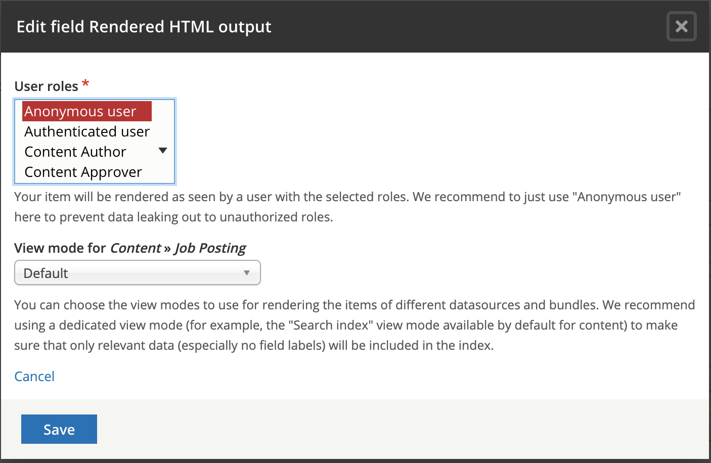

# Add fields to the index

Before we can begin using our index, we have to add fields from the Job Posting index. To create the search page, we need to be able to use some fields, such as Content Type, and node status \(whether this is a published node\). To enable Facets, we need to add State/Territory, Agency and Terms of employment.

In addition, we need to add a fully rendered entity, as it is seen by Anonymous users, so that our index can display search results ordered by relevance.

* 1. From the Fields tab of the search index, locate and add the following fields to the Search Index:
     1. Authored on \(created\)
     2. Agency \(field\_agencyref\)
     3. Content type \(type\)
     4. State \(field\_state\)
     5. Job description \(body\)
     6. Published \(status\)
     7. Terms of employment \(field\_jobterms\)
     8. Title \(title\)
     9. Rendered HTML output \(rendered\_item\)

Click **Done** and then **Save changes**

* 1. Edit the Rendered HTML output \(rendered\_item\). Make sure the **Default** is selected as the **View mode for** _**Content**_ **»** _**Job Posting**_ field. 

**Index all content**  
Before we can use search, all Job Posting content on the site needs to be reindexed.

* 1. Click the View tab at the top 
  2. Click the **Index now** button and wait for the batch process to complete

**Create Search API View Job Posting Search**  
_****_Let’s utilise the newly created Search Index and create a View that would use the index as the datasource. Unlike the previous experiences of filtering and ordering the results using Views, we’ll now be using Search API.

* 1. Go to **Structure** → **Views**, click **Add view** button
* View name: Jobs Search
* Description: Jobs search using Search API
* Show: Index Job Posting
  1. Create a page
  2. Create a menu link in the Main navigation menu
  3. Save and edit

**Configure Job Posting Search results to look like the General site search**

* 1. Clear site cache
  2. Under **Format** - click **Fields** and select **Rendered entity**, **Apply** the settings
  3. Select **Search** view mode, Apply the settings
  4. Save view

**Test Job Posting Search**

* 1. Go to the frontend of the site and find the menu link Jobs Search.
  2. Review the Jobs search result. What’s missing?

**Add search field**

* 1. Return to the View edit interface 
  2. Under Filter Criteria, click **Add**
  3. Search for “Fulltext search” from the Search category. Add it and configure the filter
  4. Expose this filter to visitors, to allow them to change it
  5. Label: empty
  6. Save the changes and save the view.
  7. Test it out.

**Add relevance sorting**

* 1. Return to the View editing interface
  2. Add Sort criteria, Relevance.
  3. Test it out.

#### **Exercise 9.4:** Extend the search with Facets

Facets is a great tool to improve search UI by adding filtering options that the end user can use to filter the search results by category, price, location and any other field. A typical use of a Facet is to allow filtering the search results by a price range on a shopping cart website.

Our Job posting content type provides fields such as Terms of employment, State/Territory and Agency. Let’s add them as facets and see if that improves our search.

1. **Ensure the Facets module is enabled**
   1. Navigate to the Extend page
   2. Filter modules by keyword **facets**
   3. Make sure the Facets module is enabled. If it isn’t already enabled, enable it and save the page.
   4. Check permissions. Click the Facets module description to expand it and open Permissions in a new tab/window. 
   5. Ensure the “Administer Facets” permission is given to the right user roles.
2. **Configure Facets**
   1. Go to **Administration** → **Configuration** → **Search and metadata** → **Facets**. This page has a few facet sources available. These facets were created for you by the Facets module from each of the Views in your site. As you may expand your site with more Views that use a Search API index, they all become available here.
   2. Locate our Job search in the Facet source, and click **configure**: 
   3. Enter a unique filter key. This key will be used in the query string to identify the facet source, which avoids errors when using multiple facets. We could leave this configuration empty; in which case the Facets will use an internally generated string.
3. **Add State/Territory facet**
   1. Click the **Add facet** button.
   2. Select View Jobs Search, display Page as the **Facet Source**.
   3. Select _State/Territory_ as the **Field**.
   4. Enter _State/Territory_ in the **Name** field. This will be used as the facet header.
   5. Save the configuration and configure the facet.
   6. Widget: List of checkboxes
   7. Show the amount of results: selected
   8. List item label: selected
   9. Transform entity ID to label: selected
   10. URL alias: state
   11. Empty facet behaviour: Do not display facet
   12.  Operator: OR
   13. Sort by active state: not selected
   14. Sort by count: not selected
   15. Sort by display value: selected
       1. Sort order: Ascending
   16. The “Sort by display value: Ascending” will ensure the taxonomy terms for the **State/Territory** will be listed alphabetically.

       Alternatively, we may enable the weight-based ordering of the facet filters to replicate the term sorting in the taxonomy vocabulary.

       For this to work, you unselect the “Sort by display value” above and select the “Sort by taxonomy term weight” checkbox.

       For now, leave the “Sort by display value” selected.

   17. Save the configuration. This will create a block, which we have to place into the **Content top** region, so it appears to the end user.
   18. Navigate to the Structure → Block Layout page.
   19. Place the State/Territory block \(category Facets\) into the **Content top** region.
   20. Save the block layout page.
   21. Test your facet by navigating to the **Jobs Search** page. 
4. Use your experience from the previous step and create a facet for the **Agency** field. Place it as a block in the **Content Top** region. 

