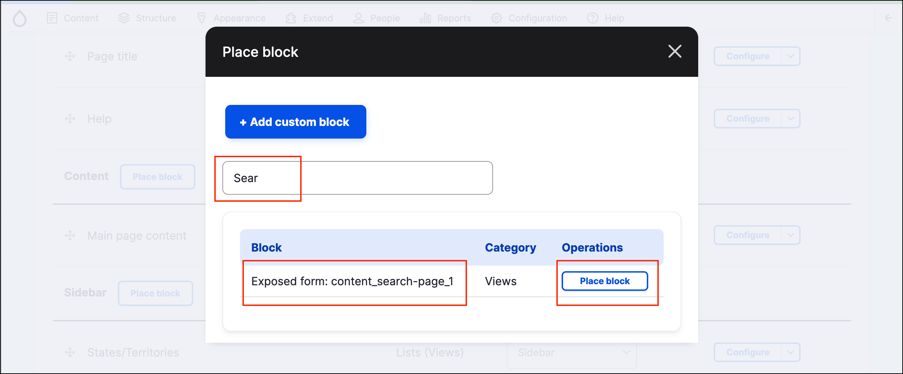
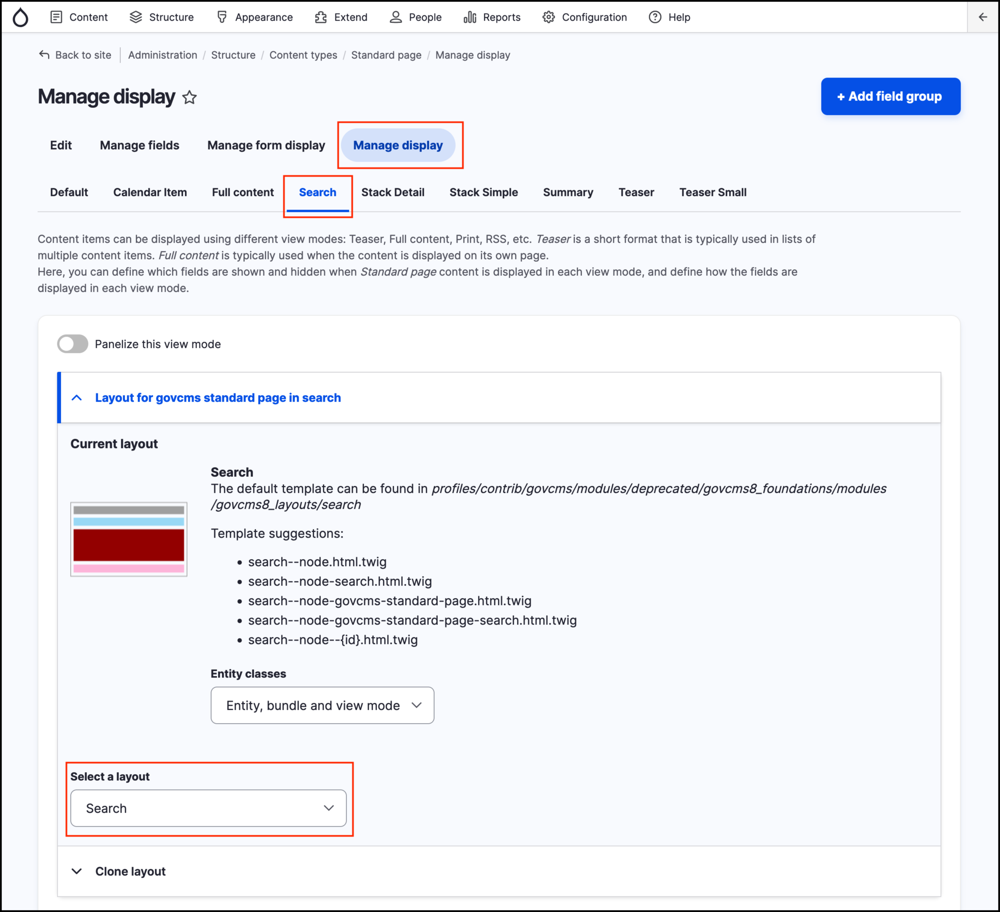
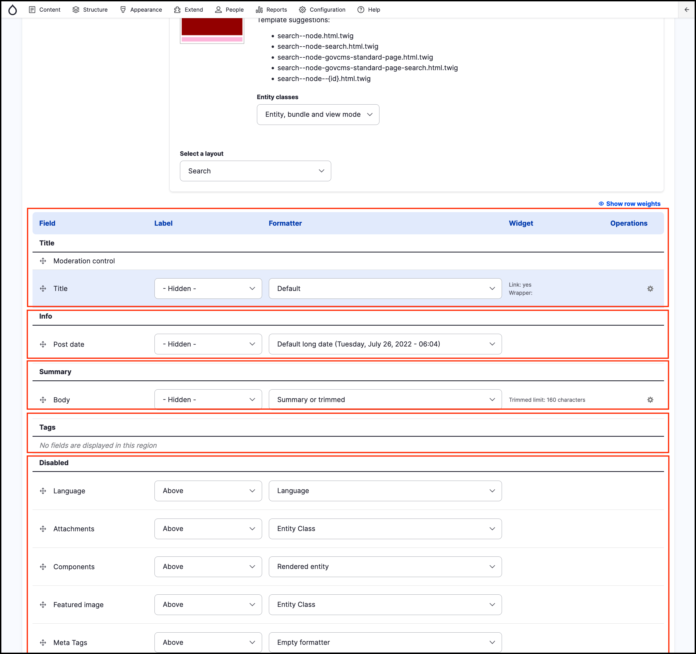

# Exercise 9.1: Explore the default search

First, let’s see how the default search works.

## Default search results

Your website should have a search block in the header or footer. If not you can add a Search block by going to _Structure_ → _Block Layout_ and clicking **Place Block** in the region you wish to add Search. Then search for 'Search'.

The screenshot below shows what a default search result may look like. By default, the search will only find full words \(so a search for “class” won't find “classroom”\).

You can control this in _Structure_ → _Content types_ → \(choose a content type\) → **Manage display**. In this screen you can configure the view mode and field display for Search results.

Note that in the given example for the _Standard Page_ content type, we use _view mode_ **Search** and **Search** _layout_, to stay consistent with other content types in GovCMS. The _view mode_ used in the search could be any other one available, as long as it’s configured to display in the search results \(we’ll explore this later\).

## Understanding the index

1. Add a new **News and Media** with a word you haven’t used before, such as “basketball”.
2. Once you’ve published the content, do a search for the word. You won’t get any results because the search doesn’t update instantly. This is because the search uses a cached index of content to speed up the results and decrease the performance impact on your website. However, the search will be updated the next time the cron job is run.
3. Try the search in a few minutes. Note: The search is case-sensitive.

## What is cron?

Cron is a method for scheduling specific tasks to run on your site. Cron is scheduled to run every three hours by default and clears the site cache when you run it. You can schedule tasks using cron as often as you’d like.

Read more [http://drupal.org/cron](http://drupal.org/cron)
