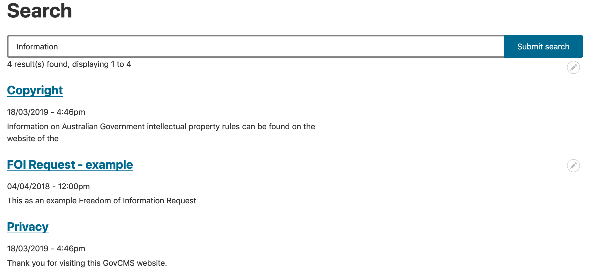
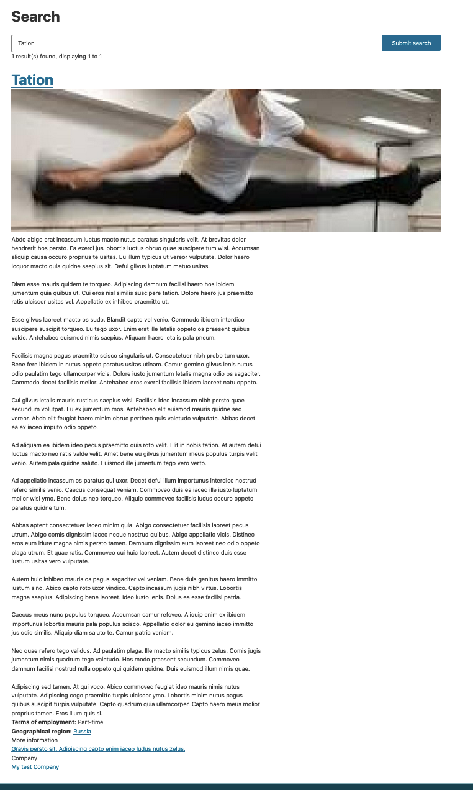
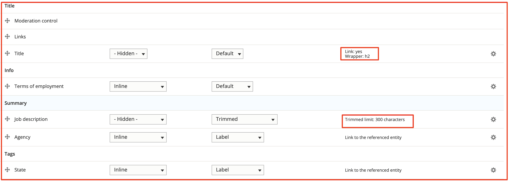
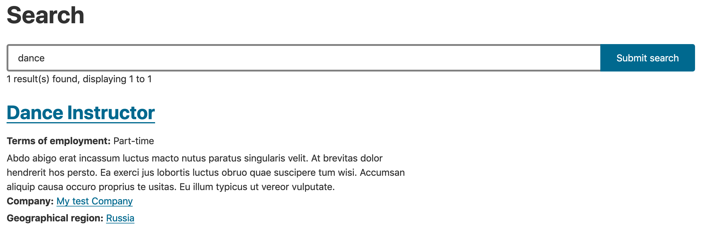
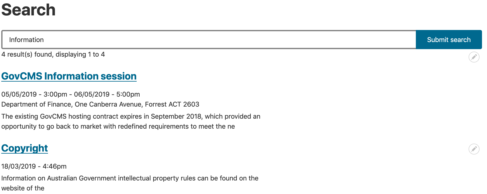

# Exercise 9.2: Set up Job posting content type display in global search

Try to conduct a search for a published Job posting content type. You’ll notice that it appears differently to other content types:

| 

Standard page search results
 | 

Not configured Job posting search result
 |
| ------------------------------------------------------------------------------------------------------------ | ------------------------------------------------------------------------------------------------------------------------ |

This is because the search index isn’t configured to display the right View mode for the Job posting content type and it shows the same content as the full-page view.

Let’s change that, by activating Search view mode in the Job Posting content type and then configuring the search to use it.

1. Go to Structure → Content types → Job Posting → Manage display.
2. Under the _Custom display settings_, enable the **Search** view mode. Save the changes.
3. Click the Search link at the top (in the secondary tabs) to navigate to the Search view mode.
4. Under the **Select a layout** field, select **Search** and save the changes. You’ll notice that the fields table below now shows multiple regions, such as:
   1. Title
   2. Info
   3. Summary
   4. Tags
   5. Disabled
5.  Rearrange fields (drag-and-drop) to match the screenshot. Move the remaining fields into the disabled region. Focus on making the Title field a link and trimming the Job description down to 300 characters.

    

    Now, as we created and customised the Job posting view mode for Search, let’s make the search page to use it. Our search page is made as a View, although it’s set to use the Search API functionality. We’ll explore how to create a Search API view later.
6.  Go to **Structure** → **Views** and edit the _Search_ view.

    
7.  Under **Format** → **Show**, click on the **Settings** link:

    
8.  Locate the “**View mode for datasource** _**Content**_**, bundle** _**Job Posting”**_ and change it to use the **Search** view mode created earlier

    
9. Apply your changes and save the view.
10. Repeat search for a job posting and confirm if the display looks similar to other content types.

    | 

Search result for Job posting
 | 

Search result for Standard page
 |
    | ------------------------------------------------------------------------------------------------------------- | --------------------------------------------------------------------------------------------------------------- |

    1. You may return to the Search view mode in the Job posting content type and change it further, to test how your changes affect the search results display widget.
