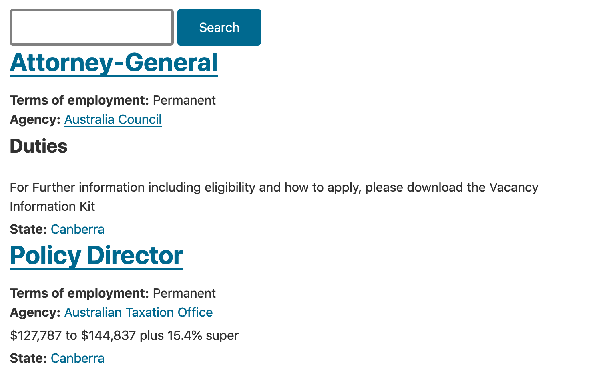

# Exercise 9.4: Add fields to the index

Before we can begin using our index, we have to add fields from the Job Posting index. To create the search page, we need to be able to use some fields, such as Content Type, and node status (whether this is a published node). To enable Facets, we need to add State/Territory, Agency and Terms of employment.

In addition, we need to add a fully rendered entity, as it is seen by Anonymous users, so that our index can display search results ordered by relevance.

## Add fields

From the Fields tab of the search index, locate and add the following fields to the Search Index:

1. Authored on (created)
2. Agency (field\_agencyref)
3. Content type (type)
4. State (field\_state)
5. Job description (body)
6. Published (status)
7. Terms of employment (field\_jobterms)
8. Title (title)
9. Rendered HTML output (rendered\_item)

Click **Done** and then **Save changes**

Edit the Rendered HTML output (rendered\_item). Make sure the **Default** is selected as the **View mode for** _**Content**_ **»** _**Job Posting**_ field.

## Index all content

Before we can use search, all Job Posting content on the site needs to be reindexed.

1.  Click the View tab at the top

    
2. Click the **Index now** button and wait for the batch process to complete.

## Create Search API View Job Posting Search

Let’s utilise the newly created Search Index and create a View that would use the index as the datasource. Unlike the previous experiences of filtering and ordering the results using Views, we’ll now be using Search API.

1. Go to **Structure** → **Views**, click **Add view** button.

* View name: Jobs Search
* Description: Jobs search using Search API
* Show: Index Job Posting

1. Create a page.
2. Create a menu link in the Main navigation menu.
3. Save and edit.

## Configure Job Posting Search results to look like the General site search

1. Clear site cache
2. Under **Format** - click **Fields** and select **Rendered entity**, **Apply** the settings
3. Select **Search** view mode, Apply the settings
4. Save view

## Test Job Posting Search

1. Go to the frontend of the site and find the menu link Jobs Search.
2. Review the Jobs search result. What’s missing?

## Add search field

1.  Return to the View edit interface

    
2. Under Filter Criteria, click **Add**.
3. Search for “Fulltext search” from the Search category. Add it and configure the filter.
4. Expose this filter to visitors, to allow them to change it.
5. Label: empty
6. Save the changes and save the view.
7. Test it out.

## Add relevance sorting

1. Return to the View editing interface.
2. Add Sort criteria, Relevance.
3. Test it out.

