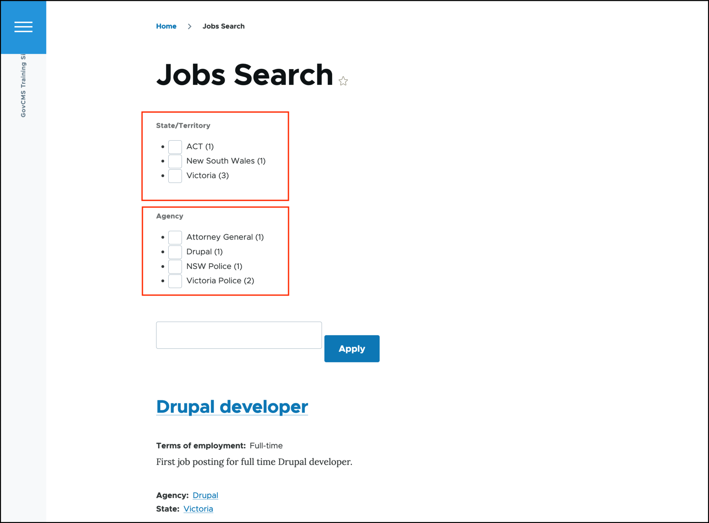
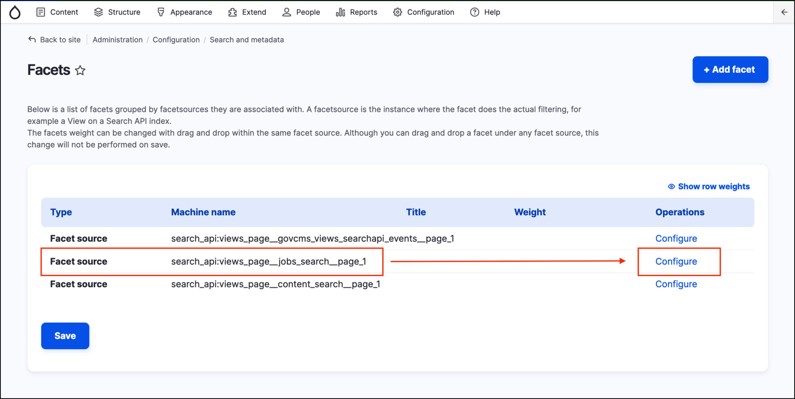
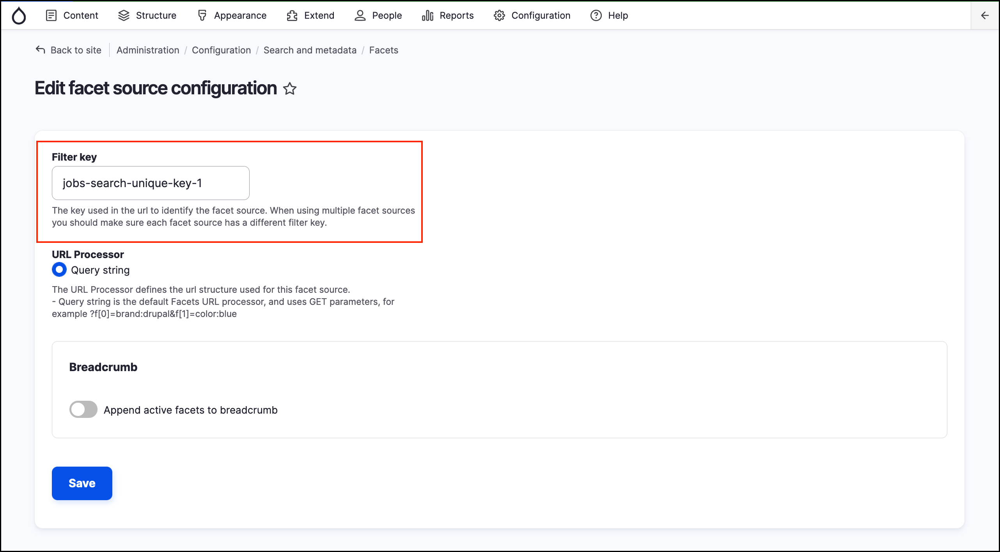
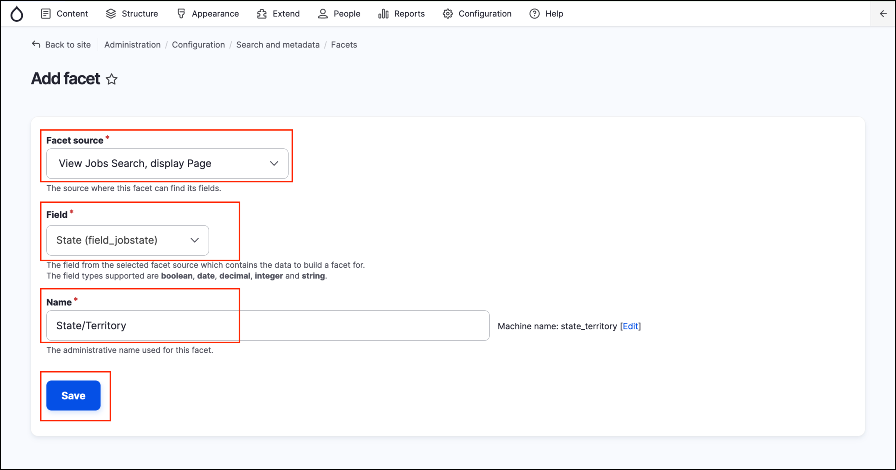
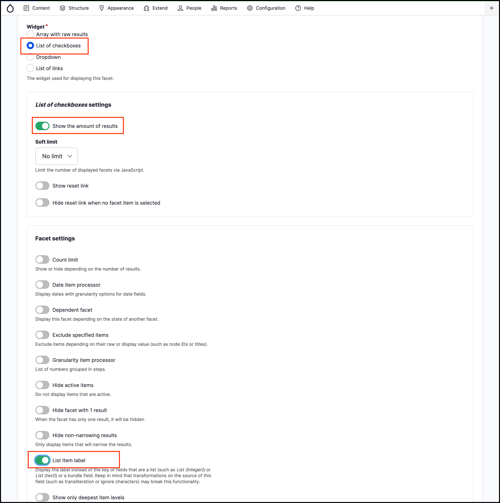
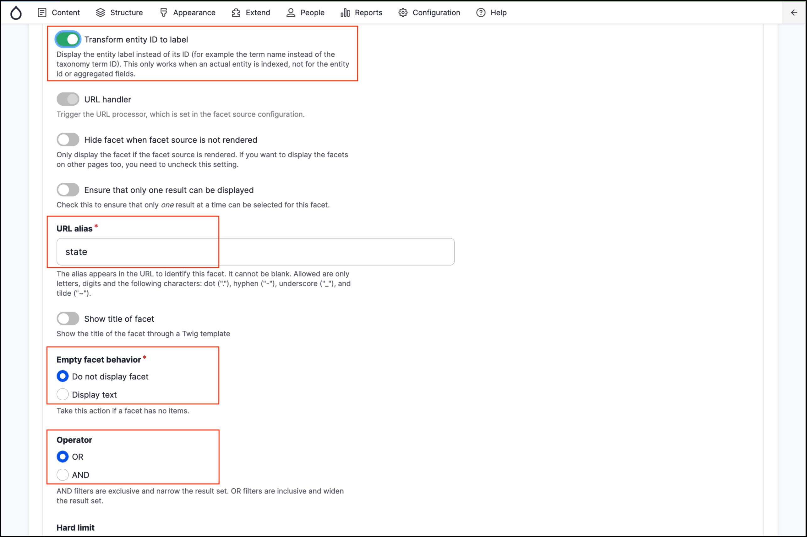
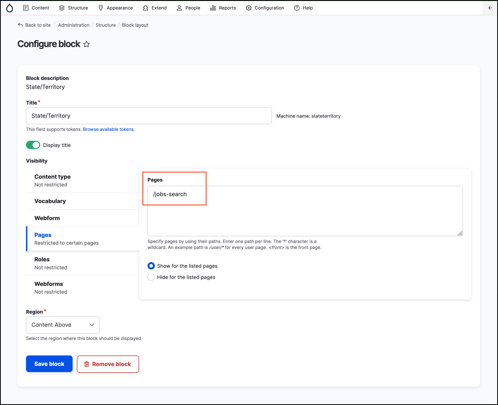
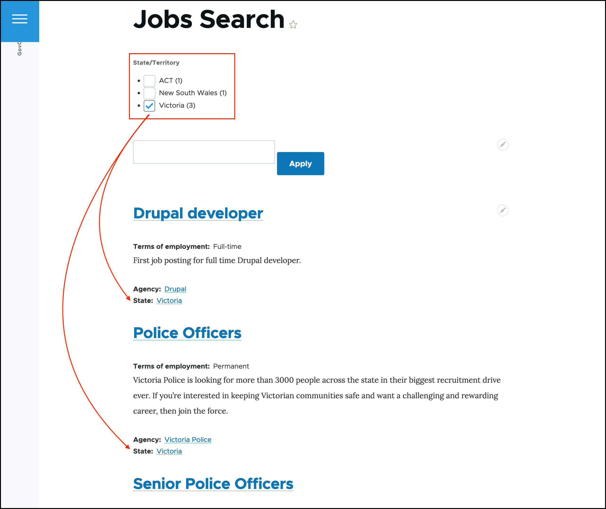
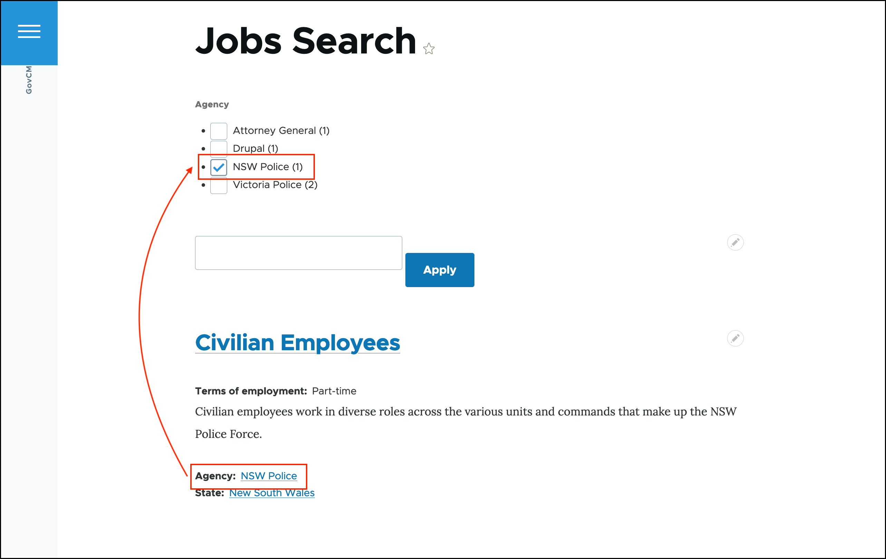

# Exercise 9.5: Extend the search with Facets

**Facets** is a great tool to improve search UI by adding **filtering options** that the end user can use to filter the search results by category, price, location or any other similar fields. A typical use of a Facet is to allow filtering the search results by a price range on a shopping cart website, or filtering jobs based on location.

Our Job posting content type provides fields such as **Terms of employment**, **State/Territory** and **Agency**. Let’s add them as facets and see if that improves our search.

**Facets** module is already enabled in your training environment.

## Configure Facets

1. Go to _Administration_ → _Configuration_ → _Search and metadata_ → **Facets**. This page has a few facet sources available. These facets were created for you by the Facets module from each of the Views in your site. As you may expand your site with more Views that use a Search API index, they all become available here.
2.  Locate our Job search in the Facet source, and click **configure**:

    
3. Enter a unique filter key. This key will be used in the query string to identify the facet source, which avoids errors when using multiple facets. We could leave this configuration empty; in which case the Facets will use an internally generated string.

## Add State/Territory facet

1. Click the **Add facet** button.
2. Select **View Jobs Search**, display Page as the **Facet Source**.
3. Select _State (field\_jobstate)_ as the **Field**.
4. Enter _State/Territory_ in the **Name** field. This will be used as the facet header.
5.  **Save** the configuration and **configure the facet**.

    
6. **Widget:** List of checkboxes.
7. **Show the amount of results:** selected.
8.  **List item label:** selected.

    
9. **Transform entity ID to label:** selected.
10. **URL alias:** state.
11. **Empty facet behaviour:** Do not display facet.
12. **Operator:** OR.

    
13. **Sort by active state:** not selected.
14. **Sort by count:** not selected.
15. **Sort by display value:** selected.
16. **Sort order:** Ascending

    
17. The “Sort by display value: Ascending” will ensure the taxonomy terms for the **State/Territory** will be listed alphabetically.

    Alternatively, we may enable the weight-based ordering of the facet filters to replicate the term sorting in the taxonomy vocabulary. For this to work, you unselect the “Sort by display value” above and select the “Sort by taxonomy term weight” checkbox.

    For now, leave the “Sort by display value” selected.
18. Save the configuration. This will create a block, which we have to place into the **Content top** region, so it appears to the end user.

## Place new Facet block in Content Top

1. Navigate to the _Structure_ → **Block Layout**.
2. Place the State/Territory block (category Facets) into the **Content above** region.
3.  Restrict the visibility of the block to the **Jobs Search** page (/jobs-search).

    
4. **Save blocks** the block layout page.
5. Test your facet by navigating to the **Jobs Search** page.

## Create facet for Agency field

Use your experience from the previous step and create a facet for the **Agency** field. Place it as a block in the **Content Top** region.

