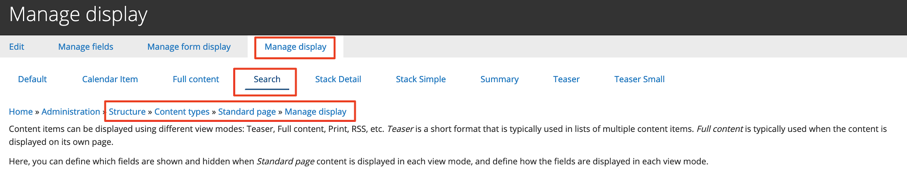

# Search and related content

Since the release of Drupal 7, the Search API module has helped thousands of site builders to add an amazing search experience to their sites. Along with its numerous add-on modules it offers great flexibility and a large range of powerful features – faceting, entity relationships, relevancy configuration, spellchecking, etc. – and its Views integration ensures that all aspects of the site's search page\(s\) can be configured in detail through a well-known interface.

For the Government Jobs portal, a faceted search tool will help job seekers find related content faster.

GovCMS provides a default search functionality which is fairly basic. For this scenario, let’s assume your website needs a more sophisticated keyword search tool with search facets, allowing to filter Jobs by a state, terms of employment and an agency.

#### **Exercise 9.1:** Explore the default search

First, let’s see how the default search works.

1. **Default search results**

   Your website should have a search block in the header. Alternatively, you can go to your site at [http://example.com/search](http://example.com/search) and type in a word you know is on your site.

   The screenshot on the next page shows what a default search result may look like. By default, the search will only find full words \(so a search for “class” won't find “classroom”\).

   1. You can control this in **Structure** → **Content types** → \(choose a content type\) → **Manage display**. In this screen you can configure the view mode and field display for Search results.

        
        
      

Note that in the given example for the _Standard Page_ content type, we use _view mode_ **Search** and **Search** _layout_, to stay consistent with other content types in GovCMS8. The _view mode_ used in the search could be any other one available, as long as it’s configured to display in the search results \(we’ll explore this later\).

**Understanding the index**

* 1. Add a new **News and Media** with a word you haven’t used before, such as “basketball”.
  2. Once you’ve published the content, do a search for the word. You won’t get any results because the search doesn’t update instantly. This is because the search uses a cached index of content to speed up the results and decrease the performance impact on your website. However, the search will be updated the next time the cron job \*\* is run.
  3. Try the search in a few minutes. Note: The search is case-sensitive.

**\*\* What is cron?**

Cron is a method for scheduling specific tasks to run on your site. Cron is scheduled to run every three hours by default and clears the site cache when you run it. You can schedule tasks using cron as often as you’d like.

Read more [http://drupal.org/cron](http://drupal.org/cron)

#### **Exercise 9.2:** Set up Job posting content type display in global search

Try to conduct a search for a published Job posting content type. You’ll notice that it appears differently to other content types:

<table>
  <thead>
    <tr>
      <th style="text-align:left">
        

          
        

        
Standard page search results

      </th>
      <th style="text-align:left">
        

          
        

        
Not configured Job posting search result

      </th>
    </tr>
  </thead>
  <tbody></tbody>
</table>This is because the search index isn’t configured to display the right View mode for the Job posting content type and it shows the same content as the full-page view.

Let’s change that, by activating Search view mode in the Job Posting content type and then configuring the search to use it.

1. Go to Structure → Content types → Job Posting → Manage display.
2. Under the _Custom display settings_, enable the **Search** view mode. Save the changes.
3. Click the Search link at the top \(in the secondary tabs\) to navigate to the Search view mode
4. Under the **Select a layout** field, select **Search** and save the changes. You’ll notice that the fields table below now shows multiple regions, such as:
   1. Title
   2. Info
   3. Summary
   4. Tags
   5. Disabled
5. Rearrange fields \(drag-and-drop\) to match the screenshot. Move the remaining fields into the disabled region. Focus on making the Title field a link and trimming the Job description down to 300 characters. 
6. Now, as we created and customised the Job posting view mode for Search, let’s make the search page to use it. Our search page is made as a View, although it’s set to use the Search API functionality. We’ll explore how to create a Search API view later. Go to **Structure** → **Views** and edit the _Search_ view. 
7. Under **Format** → **Show**, click on the **Settings** link: 
8. Locate the “**View mode for datasource** _**Content**_**, bundle** _**Job Posting”**_ and change it to use the **Search** view mode created earlier 
9. Apply your changes and save the view.
10. Repeat search for a job posting and confirm if the display looks similar to other content types

<table>
  <thead>
    <tr>
      <th style="text-align:left">
        

          
        

        
Search result for Job posting

      </th>
      <th style="text-align:left">
        

          
        

        
Search result for Standard page

      </th>
    </tr>
  </thead>
  <tbody></tbody>
</table>1. You may return to the Search view mode in the Job posting content type and change it further, to test how your changes affect the search results display widget.

